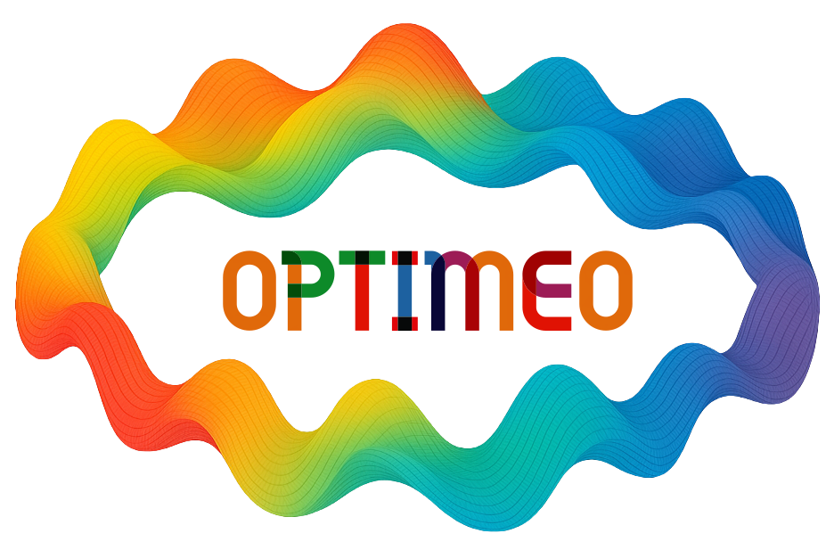

[](https://doi.org/10.5281/zenodo.15308437)
[](https://joss.theoj.org/papers/5df5fbe4e131d230b13fb3c98db545d8)
[](https://github.com/colinbousige/OPTIMEO/actions/workflows/python-app.yml)
[](https://colinbousige.github.io/OPTIMEO/optimeo.html)

# OPTIMEO – Bayesian Optimization Web App for Process Tuning, Modeling, and Orchestration 

## About this package

[OPTIMEO](https://optimeo.streamlit.app/) is a package doubled by a web application that helps you optimize your experimental process by generating a Design of Experiment, generating new experiments using Bayesian Optimization (BO), and analyzing the results of your experiments using Machine Learning models.
The OPTIMEO package is aimed at helping scientists of any field to reach the optimum parameters of their process using the minimum amount of resources and effort.
Therefore, it is based on BO for its data efficiency: when each experiment might take one or more day to run and characterize, it is much preferable to use BO to determine which parameters to use to minimize the number of experiments to run.

This package was developed within the frame of an academic research project, MOFSONG, funded by the French National Research Agency (N° ANR-24-CE08-7639). See the related paper reference in [How to cite](#how-to-cite).

## Documentation

The package documentation is available [here](https://colinbousige.github.io/OPTIMEO/optimeo.html).

## Installation

### Installing the package

Installing the package and its dependencies should take up about 1.3 GB on your hard disk, the main "heavy" dependencies being `botorch`, `scikit_learn`, `plotly`, `scipy`, `pandas` and `streamlit`.

It should be easy enough with `pip`:

```bash
git clone https://github.com/colinbousige/OPTIMEO.git
cd OPTIMEO
# Otional: create a virtual environment
python -m venv venv
source venv/bin/activate # on Linux or MacOS
# Then, install OPTIMEO as a package:
pip install .
```

If you did `pip install .`, you can upgrade to new a version or uninstall with:

```bash
# upgrade the optimeo package
cd OPTIMEO
pip install --upgrade .
# uninstall the optimeo package
pip uninstall optimeo
```

### Using the web app

- You can use the app directly on its [Streamlit.io web page](https://optimeo.streamlit.app/), but it might be a bit slow if you have a lot of data to process. 

- If you'd rather run this app on your local machine (which will most probably make it faster than running it on streamlit.io), you can do so by running the following command in your terminal:

```bash
git clone https://github.com/colinbousige/OPTIMEO.git
cd OPTIMEO
# Otional: create a virtual environment
python -m venv venv
source venv/bin/activate # on Linux or MacOS
# Then, install the required packages:
pip install -r requirements.txt # to install the required packages
```

Finally, you can run the app by running the following command in your terminal:

```bash
streamlit run Home.py
```

- You can also modify the path to the `OPTIMEO` folder in `OPTIMEO/bin/optimeo`. Then, doing the following will add the `optimeo` command to your `PATH`:

```bash
git clone https://github.com/colinbousige/OPTIMEO.git
cd OPTIMEO
pip install . # to install OPTIMEO as a package
chmod +x bin/optimeo
ln -s $(pwd)/bin/optimeo /usr/local/bin/optimeo # or any folder in your PATH
```

So now, you just have to run `optimeo` in your terminal to run the app.

## Usage

### With the web app

You can use the app directly on its [Streamlit.io web page](https://optimeo.streamlit.app/), or run it locally (see [Installation](#installation)).

Choose the page you want to use in the sidebar, and follow the instructions. Hover the mouse on the question marks to get more information about the parameters.

**1. Design of Experiment:**  
Generate a Design of Experiment (DoE) for the optimization of your process. Depending on the number of factors and levels, you can choose between different types of DoE, such as Sobol sequence, Full Factorial, Fractional Factorial, or Definitive Screening Design.

**2. New experiments using Bayesian Optimization:**  
From a previous set of experiments and their results, generate a new set of experiments to optimize your process. You can use up to 10 outcomes, of which 2 can be objectives (i.e. outcomes that you want to minimize or maximize) and the outcomes that are not objectives can be constrained.  

**3. Data analysis and modeling:**  
Analyze the results of your experiments and model the response of your process.

### With the Python package

You can also use the app as a Python package (see [Installation](#installation)). You can import the different modules of the app and use them in your own code. Here is an example of how to use the app as a package:

#### For Design of Experiment

A more detailed example is given in [the notebook](https://colab.research.google.com/github/colinbousige/OPTIMEO/blob/main/notebooks/doe.ipynb).

```python
from optimeo.doe import * 
parameters = [
    {'name': 'Temperature', 'type': 'integer', 'values': [20, 40]},
    {'name': 'Pressure', 'type': 'float', 'values': [1, 2, 3]},
    {'name': 'Catalyst', 'type': 'categorical', 'values': ['A', 'B', 'C']}
]
doe = DesignOfExperiments(
    type='Sobol sequence',
    parameters=parameters,
    Nexp=8
)
doe
```

#### For Bayesian Optimization

A more detailed example is given in [the notebook](https://colab.research.google.com/github/colinbousige/OPTIMEO/blob/main/notebooks/bo.ipynb).

```python
from optimeo.bo import * 

features, outcomes = read_experimental_data('experimental_data.csv', out_pos=[-1])
bo = BOExperiment(
    features=features, 
    outcomes=outcomes,
    N = 2, # number of new points to generate
    maximize=True, # we want to maximize the response
    fixed_features=None, 
    feature_constraints=None, 
    optim = 'bo'
)
bo.suggest_next_trials()
```

#### For Data Analysis

A more detailed example is given in [the notebook](https://colab.research.google.com/github/colinbousige/OPTIMEO/blob/main/notebooks/MLanalysis.ipynb).

```python
from optimeo.analysis import * 

data = pd.read_csv('dataML.csv')
factors = data.columns[:-1].tolist()
response = data.columns[-1]
analysis = DataAnalysis(data, factors, response)
analysis.model_type = "ElasticNetCV"
MLmodel = analysis.compute_ML_model()
figs = analysis.plot_ML_model()
for fig in figs:
    fig.show()
```

## Support

This app was made by [Colin Bousige](mailto:colin.bousige@cnrs.fr). Contact me for support or to signal a bug, or leave a message on the [GitHub page of the app](https://github.com/colinbousige/OPTIMEO).

## How to cite

<!-- This work is related to the article "xxxx". Please cite this work if you publish using this code:

```bibtex
@article{xxx,
    title = {xxx},
    author = {xxx},
    journal = {xxx},
    volume = {xxx},
    year = {xxx},
    pages = {xxx},
    doi = {xxx}
}
``` -->

The source can be found [on Github](https://github.com/colinbousige/optimeo), please consider citing it as:

```bibtex
@software{Bousige_optimeo,
    author = {Bousige, Colin},
    title = {{OPTIMEO}},
    url = {https://github.com/colinbousige/optimeo},
    doi={10.5281/zenodo.15308437}
}
```

## Acknowledgements

This work was supported by the French National Research Agency (N° ANR-24-CE08-7639).  
Also, this work was made possible thanks to the following open-source projects:

- [ax](https://ax.dev/)
- [BoTorch](https://botorch.org/)
- [scikit-learn](https://scikit-learn.org/stable/)
- [pyDOE3](https://github.com/relf/pyDOE3)
- [dexpy](https://statease.github.io/dexpy/)
- [doepy](https://doepy.readthedocs.io/en/latest/)
- [definitive-screening-design](https://pypi.org/project/definitive-screening-design/)

## License

[](https://opensource.org/licenses/MIT)

This project is licensed under the MIT License - see the [LICENSE](LICENSE) file for details
